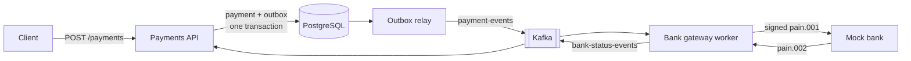
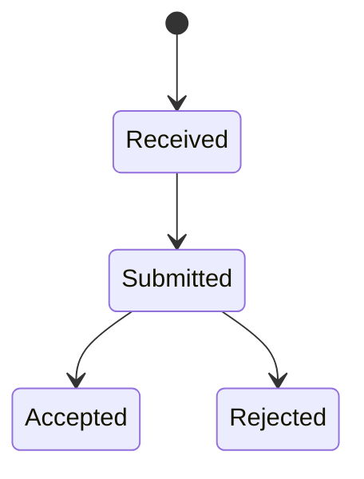

# Payment Gateway (ISO 20022)

[](https://github.com/dnk89/simple-banking/actions/workflows/ci.yml)


A .NET 10 backend that accepts payment orders over REST, turns them into signed ISO 20022 `pain.001` files, sends them to a simulated bank, and tracks each payment to its final status.

Built to demonstrate reliable messaging in a payments context: transactional outbox, idempotent consumers, and retries over Kafka.

<!-- Keep the two paragraphs above short. A reviewer should understand the project from them alone. -->

## Highlights

- **Transactional outbox:** payment and event are written in one database transaction, so no event is lost if the app crashes before publishing.
- **Idempotent API:** the `Idempotency-Key` header guarantees that a retried request never creates a second payment.
- **Idempotent Kafka consumers:** duplicate messages are detected, with retry and dead-letter topics for failures.
- **ISO 20022:** `pain.001.001.09` generation with XML signature and XSD validation in tests; `pain.002.001.10` status processing.
- **Observability:** one OpenTelemetry trace follows a payment across API, Kafka, worker and bank.
- **Testing:** integration tests against real PostgreSQL and Kafka using Testcontainers.

<!-- Only list what is actually implemented. Add items as you build them. -->

## Architecture



1. The client submits a payment with an `Idempotency-Key`.
2. The API validates it and stores the payment and an outbox record in one transaction.
3. The outbox relay publishes the event to Kafka, keyed by payment ID to keep per-payment ordering.
4. The bank gateway worker maps the payment to `pain.001`, signs it and sends it to the mock bank.
5. The mock bank returns a `pain.002` status report; the worker publishes the status, and the API updates the payment.

## Quick start

Requirements: Docker. The .NET 10 SDK is only needed to run tests.

```bash
git clone git@github.com:dnk89/simple-banking.git
cd simple-banking
docker compose up -d
```

Create a payment:

```bash
curl -X POST http://localhost:8080/payments \
  -H "Content-Type: application/json" \
  -H "Idempotency-Key: 3f9a2c1e-0000-0000-0000-000000000001" \
  -d '{
    "debtorIban": "LV80BANK0000435195001",
    "creditorName": "Example SIA",
    "creditorIban": "DE89370400440532013000",
    "amount": 125.50,
    "currency": "EUR",
    "remittanceInfo": "Invoice 2026-104",
    "requestedExecutionDate": "2026-10-05",
    "endToEndId": "INV-2026-104"
  }'
```

Check its status:

```bash
curl http://localhost:8080/payments/[id]
```

Tracing dashboard: http://localhost:18888

<!-- Verify every command above from a fresh clone before publishing. -->

## Payment lifecycle



<!-- Update if you add states, e.g. Failed after the dead-letter topic. -->

## Failure scenarios

| Scenario | What happens | Proven by |
|---|---|---|
| Client retries the same request | Same payment returned, no duplicate | [`TestName`](link-to-test) |
| Same key, different request body | Rejected with `422` | [`TestName`](link-to-test) |
| Crash after database commit, before publishing | Outbox relay publishes on restart | [`TestName`](link-to-test) |
| Kafka delivers a message twice | Duplicate detected, no second bank file | [`TestName`](link-to-test) |
| Bank times out | Retries with backoff, then retry topic | [`TestName`](link-to-test) |
| Message keeps failing | Moved to dead-letter topic | [`TestName`](link-to-test) |
| Status arrives out of order | State machine ignores invalid transitions | [`TestName`](link-to-test) |

<!-- This is the most valuable section. Add a row only when a test proves it. -->

## Design decisions

- [ADR-001: Transactional outbox instead of dual writes](docs/adr/001-transactional-outbox.md)
- [ADR-002: Kafka with payment ID as message key](docs/adr/002-kafka-message-key.md)
- [ADR-003: Domain model in the API, ISO 20022 only in the bank adapter](docs/adr/003-iso20022-adapter.md)
- [ADR-004: One payment per pain.001 file](docs/adr/004-no-batching.md)

## Testing

| Level | What it covers |
|---|---|
| Unit | IBAN validation, state transitions, `pain.001` mapping and XSD validation |
| Integration | Outbox, Kafka consumers and repositories against real containers (Testcontainers) |
| End-to-end | One payment from API request to final bank status |

```bash
dotnet test
```

## Observability


<!-- Screenshot of a single payment trace from the tracing dashboard. -->

## Project structure

```text
src/
  Payments.Api/          REST API, domain model, outbox
  BankGateway.Worker/    Kafka consumer, ISO 20022 mapping and signing
  MockBank/              Simulated bank with configurable failures
  Contracts/             Shared event contracts
tests/
  [test projects]
docs/
  adr/                   Architecture decision records
```

## Simplifications

- A mock bank replaces real bank connectivity.
- XML is signed with a self-signed certificate.
- API key authentication instead of OAuth2.
- One payment per `pain.001` file; batching is out of scope.
- Single Kafka broker in Docker Compose.

## How AI was used

AI tools (Claude Code) generated scaffolding, Docker Compose, CI configuration and XSD-based classes. I wrote the core logic myself (outbox, idempotent consumers, state machine) and used AI to review it for race conditions and failure modes, turning findings into tests.